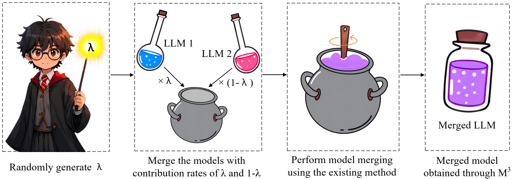
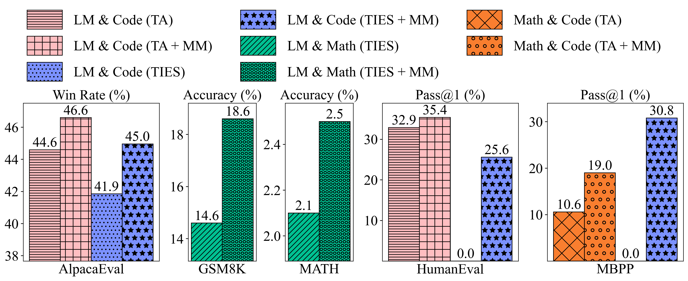
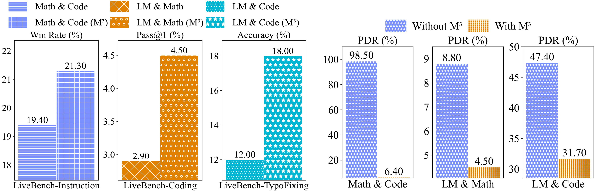
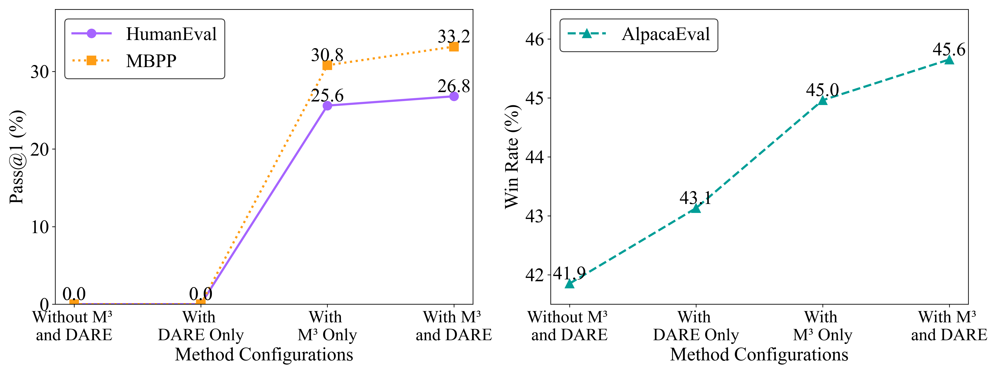

# Mixup Model Merge: Enhancing Model Merging Performance through Randomized Linear Interpolation

<div  align="center">  
 
</div>

This repository is created for the 📃paper [Mixup Model Merge: Enhancing Model Merging Performance through Randomized Linear Interpolation](https://arxiv.org/pdf/2502.15434). If you have any questions or suggestions, feel free to open an issue. We'd be happy to assist!

## Updates
- 🔥 **2025/02/27**: Released the codebase of Mixup Model Merge (M<sup>3</sup>) on GitHub.
- 🔥 **2025/02/26**: Released the first version of our 🚀[paper](https://arxiv.org/pdf/2502.15434).


## Introduction
In this study, we propose Mixup Model Merge (M<sup>3</sup>), an innovative approach inspired by the [Mixup data augmentation technique](https://arxiv.org/pdf/1710.09412). This method merges the parameters of two large language models (LLMs) by randomly generating linear interpolation ratios, allowing for a more flexible and comprehensive exploration of the parameter space.
The implementation of M<sup>3</sup> is similar to the process of proportionally mixing magical potions in \textit{Harry Potter}:

<div  align="center">  
 
</div>

Extensive experimental results show that:
1. M<sup>3</sup> significantly improves the performance of merged models across various tasks (as shown in (a));
2. M<sup>3</sup> enhances the OOD and adversarial robustness of the merged models (as shown in (b));
3. M<sup>3</sup> boosts model merging when combined with sparsification techniques like [DARE](https://openreview.net/pdf?id=fq0NaiU8Ex) (as shown in (c)).

<div align="center">
      
    <p>(a) Performance of the merged models obtained through Task Arithmetic and TIES-Merging with/without M$^3$.</p>
</div>
<div align="center">
      
    <p>(b) (Left) Performance of merged models with/without M$^3$ on OOD datasets. (Right) Adversarial robustness (PDR) of merged models with/without M$^3$.</p>
</div>
<div align="center">
      
    <p>(c) The performance trend of the merged models obtained through the following methods: TIES-Merging without M$^3$ and DARE, TIES-Merging with DARE, TIES-Merging with M$^3$, and TIES-Merging with both M$^3$ and DARE.</p>
</div>

## Task-Specific Fine-Tuned LLMs and Datasets
* We conduct model merging experiments on three task-specific fine-tuned LLMs: WizardLM-13B (LM), WizardMath-13B (Math), and llama-2-13b-code-alpaca (Code), all based on Llama-2-13B as the pre-trained backbone.
* We evaluate performance across three tasks using five datasets: AlpacaEval (instruction-following), GSM8K and MATH (mathematical reasoning), and HumanEval and MBPP (code generation).

## Model Merging Methods
We follow the implementation of five model merging methods in the [Super Mario repository](https://github.com/yule-BUAA/MergeLM), including [Average Merging](https://arxiv.org/abs/2203.05482), [Task Arithmetic](https://arxiv.org/abs/2212.04089), and [TIES-Merging](https://arxiv.org/abs/2306.01708). Additionally, we combine the proposed [Mixup Model Merge (M<sup>3</sup>)](https://arxiv.org/pdf/2502.15434) with these methods to enhance merging performance.

## Model Robustness Evaluation
### Out-of-distribution robustness
To assess OOD robustness, we use the instruction-following (LiveBench-Instruction), coding (LiveBench-Coding), and language comprehension (LiveBench-TypoFixing) categories in [LiveBench](https://arxiv.org/pdf/2406.19314). We select recent, diverse datasets to ensure they represent OOD data, with *Math \& Code* evaluated on LiveBench-Instruction, *LM \& Math* on LiveBench-Coding, and *LM \& Code* on LiveBench-TypoFixing.

❗**Note 1**: "Math \& Code," "LM \& Math," and "LM \& Code" represent the merged models.

❗**Note 2**: For OOD robustness of LM & Code, only the typo-fixing task in LiveBench-TypoFixing is considered, abbreviated as LiveBench-TypoFixing.

### Adversarial robustness
We utilize the Adversarial Prompt Attacks module in [PromptBench](https://github.com/microsoft/promptbench/tree/main/promptbench/prompt_attack) to assess the robustness of LLMs against adversarial prompts. Specifically, we employ three attack methods: DeepWordBug (character-level), BERTAttack (word-level), and StressTest (sentence-level). The evaluation is conducted on two datasets supported by PromptBench: SST2 (sentiment analysis) and CoLA (grammatical correctness).

# Environments Installation
PyTorch 2.0.1, vllm 0.1.4, transformers 4.33.1, datasets 2.13.1, numpy 1.26.3, fsspec 2023.9.2, human-eval, tqdm, jsonlines, fraction, and accelerate.

# Scripts for Merging Models
* Example of merging *WizardLM-13B-V1.2* and *WizardMath-13B-V1.0* using Average Merging, Task Arithmetic (scaling_coefficient 1.0) or TIES-Merging (scaling_coefficient 1.0, param_value_mask_rate 0.5):
```{bash}
python merge_llms_instruct_math_code.py --merge_instruct --merge_math --merging_method_name average_merging --tensor_parallel_size 2
python merge_llms_instruct_math_code.py --merge_instruct --merge_math --merging_method_name task_arithmetic --scaling_coefficient 1.0 --tensor_parallel_size 2
python merge_llms_instruct_math_code.py --merge_instruct --merge_math --merging_method_name ties-merging --scaling_coefficient 1.0 --param_value_mask_rate 0.5 --tensor_parallel_size 2
```
* Example of merging *WizardLM-13B-V1.2* and *WizardMath-13B-V1.0* using Average Merging with M<sup>3</sup> (alpha 0.5):
```{bash}
python merge_llms_instruct_math_code.py --merge_instruct --merge_math --merging_method_name average_merging --tensor_parallel_size 2 --mixup --alpha 0.5
```
* Example of merging *WizardLM-13B-V1.2* and *WizardMath-13B-V1.0* using Average Merging with DARE (drop rate 0.2):
```{bash}
python merge_llms_instruct_math_code.py --merge_instruct --merge_math --merging_method_name mask_merging --use_weight_rescale --weight_mask_rate 0.2 --mask_apply_method average_merging --tensor_parallel_size 2
```
* Example of merging *WizardLM-13B-V1.2* and *WizardMath-13B-V1.0* using Average Merging with M<sup>3</sup> and DARE (drop rate 0.2, alpha 0.5):
```{bash}
python merge_llms_instruct_math_code.py --merge_instruct --merge_math --merging_method_name mask_merging --use_weight_rescale --weight_mask_rate 0.2 --mask_apply_method average_merging --tensor_parallel_size 2 --mixup --alpha 0.5
```
❗**Note 1**: When merging LLMs, the number of GPUs required = num_models_to_merge * tensor_parallel_size.

# Evaluation Process for AlpacaEval, HumanEval and MBPP
Following the [Super Mario repository](https://github.com/yule-BUAA/MergeLM), we will store the generated files. Please run the following evaluation commands to obtain the final metrics.

* For AlpacaEval:
First, please visit the alpaca_eval repository to install the required environment.
Then, to evaluate the generated *average_merging.json* file, which contains the inference results for the merged *LM \& Code* model obtained by applying Average Merging to *WizardLM-13B-V1.2* and *llama-2-13b-code-alpaca*, please run the following command:
```{bash}
alpaca_eval --model_outputs ./save_gen_instruct_responses_results/instruct_code/alpaca_eval/average_merging.json --annotators_config chatgpt_fn --name average_merging
```
❗**Note 1**: `--annotators_config chatgpt_fn` indicates the use of `chatgpt_fn` from the [alpaca_eval repository](https://github.com/tatsu-lab/alpaca_eval) to compute the win rate.

❗**Note 2**: The [alpaca_eval repository](https://github.com/tatsu-lab/alpaca_eval) has been upgraded to AlpacaEval 2.0, and we now default to using AlpacaEval 2.0 for evaluation.

* For HumanEval:
First, install the environment from the [human-eval repository](https://github.com/openai/human-eval).  
Then, to evaluate the generated *average_merging.json* file, run:
```{bash}
evaluate_functional_correctness ./save_gen_codes_results/instruct_code/human_eval/average_merging.jsonl
```

* For MBPP:
First, install the environment according to the [bigcode-evaluation-harness repository](https://github.com/bigcode-project/bigcode-evaluation-harness).  
Then, to evaluate the generated *average_merging.jsonl* file, run:
```{bash}
accelerate launch ./bigcode-evaluation-harness/main.py --tasks mbpp --allow_code_execution --load_generations_path ./save_gen_codes_results/instruct_code/mbpp/average_merging.jsonl
```


# Scripts for Robustness Evaluation
## OOD Robustness
*Math \& Code* is evaluated on LiveBench-Instruction, *LM \& Math* on LiveBench-Coding, and *LM \& Code* on LiveBench-TypoFixing. Download the corresponding data from the [LiveBench HF repository](https://huggingface.co/livebench).

### First, run our inference code to generate the inference result files for evaluation on LiveBench-Instruction and LiveBench-Coding. Then, use the code from the [LiveBench repository](https://arxiv.org/pdf/2406.19314) to obtain the final metrics.
1. For example, to inference Math & Code on LiveBench-Instruction, please run:
```{bash}
python ood_robust_inference.py --load_model_path /path/to/your/merged/model --tensor_parallel_size 4 --evaluate_task instruction_following
```
❗**Note 1**: The folder path for storing the inference results is: `./save_gen_instruction_following_livebench_results/instruction_following`.

2. First, set up the environment according to the [LiveBench repository](https://arxiv.org/pdf/2406.19314) and then run the following command:
```{bash}
git clone https://github.com/LiveBench/LiveBench.git
cd LiveBench
conda create -n livebench python=3.10
conda activate livebench
cd LiveBench
pip install -e .
```
Secondly, place the generated inference result folders, `instruction_following` and `coding`, in the `LiveBench/data/live_bench` directory.

to obtain the final metrics on LiveBench-Instruction, run:
```{bash}
python gen_ground_truth_judgment.py --bench-name live_bench/instruction_following
python show_livebench_result.py --bench-name live_bench/instruction_following
```
to obtain the final metrics on LiveBench-Coding, run:
```{bash}
python gen_ground_truth_judgment.py --bench-name live_bench/coding
python show_livebench_result.py --bench-name live_bench/coding
```

### For evaluation on LiveBench-TypoFixing, simply run the following command to obtain the final metrics:
```{bash}
python ood_robust_inference.py --load_model_path /path/to/your/merged/model --tensor_parallel_size 4 --evaluate_task typos
```

## Adversarial robustness
1. Prepare the adversarial robustness evaluation environment：
```{bash}
cd promptbench
conda create --name promptbench python=3.10
conda activate promptbench
pip install -r requirements_adv.txt
```
2. Take StressTest as the prompt attack method and evaluate the adversarial robustness of the merged model on the SST2 dataset:
```{bash}
cd promptbench
python sst2.py --model_path /path/to/your/merged/model --attack_method stresstest
```
Take StressTest as the prompt attack method and evaluate the adversarial robustness of the merged model on the CoLA dataset:
```{bash}
python cola.py --model_path /path/to/your/merged/model --attack_method stresstest
```
❗**Note 1**: To ensure proper package references, run the above Adversarial robustness evaluation script within the `promptbench` folder.

❗**Note 2**: The script will automatically download the corresponding dataset from HF during execution.

## Acknowledgments
We sincerely thank the authors of the [Super Mario repository](https://github.com/yule-BUAA/MergeLM) for making their project code publicly available.

## Citation
If you find this project helpful, please consider citing our paper.
```{bibtex}
@article{zhou2025mixup,
  title={Mixup Model Merge: Enhancing Model Merging Performance through Randomized Linear Interpolation},
  author={Zhou, Yue and Chang, Yi and Wu, Yuan},
  journal={arXiv preprint arXiv:2502.15434},
  year={2025}
}
```
